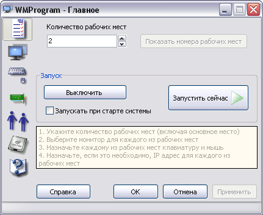

# WMProgram

**WM Program** позволяет сделать из одного компьютера, под управлением Windows XP® - несколько рабочих мест, абсолютно идентичных обычному рабочему месту.

Для этого необходимо подключить к системному блоку оборудование для дополнительных мест (наборы: монитор, клавиатура/мышь). Установить необходимые драйвера для устройств и проверить их работоспособность. Запустить программу WM Program и выполнить в ней следующие шаги:

1. Указать количество рабочих мест и способ запуска
2. Выбрать монитор для каждого из рабочих мест
3. Назначить каждому из рабочих мест клавиатуру и мышь

После чего станет возможной работа за одним компьютером нескольких человек.

Также, при необходимости, можно произвести дополнительные настройки

1. Назначить каждому рабочему месту свой IP адрес
2. Назначить автоматический вход для каждого из рабочих мест
3. Настроить нагрузку на процессоры в многоядерной системе

Более подробная информация во встроенной справке.

Инсталлятор находится в директории installer/full/Output
